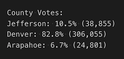
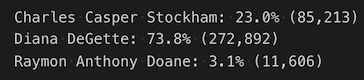

# election-analysis
Python is used to automate the vote-counting process of an election.
# Overview of Election Audit
This analysis will assist a Colorado board of elections employee in an election audit for a us congressional precinct in Colorado. The report will consist of the total number of votes cast, number and percentage for votes of each candidate, and the winner of the election based on popular vote. 
## Purpose
The purpose of this election audit is to generate a vote count report to certify the election.
Python will be used to automate the vote-counting process so that the code can be reused to audit other congressional districts, senatorial districts, and local elections.

# Election-Audit Results:
## election outcome 
  * A total of 369,711 votes were cast in this election.
### county outcome
* The county with the largest voter turnout is Denver. 306,055 votes came from Denver. This is 82.8% of the votes that were cast. 
* Jefferson had the second largest voter turnout with 38,855 votes or 10.5% of the total votes cast coming for there.
* The lowest voter turnout of the three counties is Arapahoe. Only 24,801 votes came from Arapahoe. This is 6.7% of the total votes.

### candidate outcome
* The winning candidate in this election is Diana DeGette with 73.8% of the total votes and a final vote count of 272,892.
* The runner up in this election is Charles Casper Stockham. There were 85,213 votes for him, which makes up 23.0% of all of the votes.
* Raymon Anthony Doane came in last getting 11,606 or 3.1% of the votes. 
  

# Election-Audit Summary
With some modifications made to the code, this script can be reused and applied to other elections. 
## script modification 
* one modification that will need to be made to  the script is in line 6 when assigning the file_to_load variable. The path will need to be changed to load the correct election results for whatever election the code is being used for.
* The code used to pull the county outcomes could also be altered to look at different boundaries. Instead of looking at counties for other elections the code could be used to look at votes by district or ward.